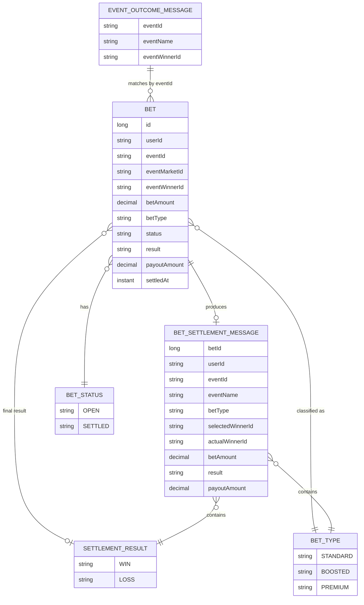
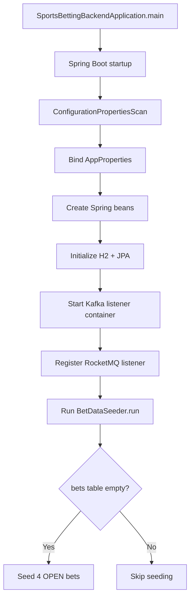

# Sports Betting Backend Technical Details

This project is a Spring Boot backend for an event-driven sports betting settlement workflow. It exposes a single REST API that accepts a sports event outcome, publishes that outcome to Kafka, matches the outcome against open bets stored in an in-memory H2 database, calculates win/loss and payout for each matching bet, publishes one settlement message per bet to RocketMQ, and then consumes those settlement messages to finalize each bet in the database. The application is intentionally designed as an asynchronous pipeline so that the HTTP layer only starts the process, while Kafka and RocketMQ handle the downstream settlement stages. The runtime remains a single Spring Boot application, but the codebase is organized as a Maven reactor with the modules `app`, `common-bean`, `core-services`, `intake-service`, `bet-settlement-service`, and `bet-finalizer-service`.

Functionally, the project has four main responsibilities: accept and validate event outcomes, persist and query bet state, calculate settlement decisions using configured payout rules, and coordinate message flow across Kafka and RocketMQ. For this MVP there is no bet-placement API. Instead, when the application starts, H2 begins empty and `BetDataSeeder` inserts a small set of demo open bets if the `bets` table is empty so the full flow can be tested immediately. When an outcome is received, only open bets for the same `eventId` are considered, winning bets receive a payout based on `BetType`, losing bets always settle to `0.00`, and the final settled state is written back to H2 with result, payout, and settlement timestamp.

## 1. Technology Stack

### Application Runtime

- Language: Java 17
- Build tool: Maven Wrapper (`./mvnw`)
- Framework: Spring Boot `3.5.0`
- Web/API: Spring Web (REST controller layer)
- Validation: Jakarta Bean Validation via `spring-boot-starter-validation`
- Persistence: Spring Data JPA + H2 in-memory database
- Kafka integration: `spring-kafka`
- RocketMQ integration: `rocketmq-spring-boot-starter 2.3.5`
- Serialization: Jackson `ObjectMapper`
- Logging: SLF4J + Spring Boot default logging

### Local Infrastructure

- ZooKeeper: `confluentinc/cp-zookeeper:7.6.0`
- Kafka broker: `confluentinc/cp-kafka:7.6.0`
- RocketMQ NameServer: `apache/rocketmq:5.3.1`
- RocketMQ Broker: `apache/rocketmq:5.3.1`
- Infrastructure orchestration: Docker Compose

### Testing

- Unit and slice tests: Spring Boot Test, JUnit 5, Mockito
- Kafka integration testing: `spring-kafka-test` with embedded Kafka
- JPA tests: `@DataJpaTest`

## 2. Runtime Configuration

### Messaging Topics

- Kafka topic: `event-outcomes`
- RocketMQ topic: `bet-settlements`

### Default Connectivity

- Kafka bootstrap servers: `localhost:9092`
- RocketMQ nameserver: `localhost:9876`
- H2 JDBC URL: `jdbc:h2:mem:sportsbetting;DB_CLOSE_DELAY=-1;DB_CLOSE_ON_EXIT=FALSE`

### Settlement Rules

- `STANDARD` payout ratio: `1.0`
- `BOOSTED` payout ratio: `1.5`
- `PREMIUM` payout ratio: `2.0`
- Losing bets always settle with payout `0.00`
- Ratios are applied only when the settlement result is `WIN`
- For this assessment MVP, `BetType` is used as a simplified proxy for relative odds/risk
- `STANDARD` represents highest probability and lowest return
- `BOOSTED` represents medium probability and higher return
- `PREMIUM` represents lowest probability and highest return

## 3. Project Layout

```text
SportyGroupWorkspace/
├── docker-compose.yml
├── docker/
│   └── rocketmq/
│       └── broker.conf
├── Requirement.md
├── SportsBettingBackend/
│   ├── pom.xml
│   ├── README.md
│   ├── app/
│   │   ├── pom.xml
│   │   └── src/
│   ├── common-bean/
│   │   ├── pom.xml
│   │   └── src/
│   ├── core-services/
│   │   ├── pom.xml
│   │   └── src/
│   ├── intake-service/
│   │   ├── pom.xml
│   │   └── src/
│   ├── bet-settlement-service/
│   │   ├── pom.xml
│   │   └── src/
│   └── bet-finalizer-service/
│       ├── pom.xml
│       └── src/
└── SportsBettingBackend.TECHNICAL.md
```

### Module Intent

- `app`: Spring Boot bootstrap class, `application.yml`, and the full integration test
- `common-bean`: shared configuration, domain types, repository access, and startup data seeding
- `core-services`: use-case orchestration and business logic
- `intake-service`: inbound HTTP contract, request/response DTOs, and Kafka event-outcome publishing adapter
- `bet-settlement-service`: Kafka consumption and RocketMQ settlement publishing
- `bet-finalizer-service`: RocketMQ consumption and final settlement application

## 4. Detailed Component Design

### 4.1 API Layer

The API layer exposes one write endpoint:

- `POST /api/event-outcomes`

Input contract:

- `eventId`
- `eventName`
- `eventWinnerId`

Behavior:

1. Validate request fields with `@NotBlank`
2. Convert the HTTP DTO into `EventOutcomeMessage`
3. Publish the message to Kafka
4. Return `202 Accepted`

This layer does not perform settlement. It only starts the asynchronous pipeline.

### 4.2 Application Layer

The application layer contains the business flow:

- `EventOutcomePublisherService`
  - converts HTTP request data into the internal event-outcome message
  - delegates outbound Kafka publishing

- `BetSettlementOrchestratorService`
  - reacts to consumed event outcomes
  - fetches matching open bets by `eventId`
  - calculates win/loss and payout
  - produces one RocketMQ settlement message per matching bet

- `PayoutCalculator`
  - determines `WIN` vs `LOSS`
  - applies the configured payout ratio by `BetType`
  - returns `0.00` immediately for losing bets because the stake is fully lost
  - treats `STANDARD`, `BOOSTED`, and `PREMIUM` as simplified relative-risk categories rather than externally supplied market odds

- `BetSettlementFinalizerService`
  - consumes logical settlement results
  - loads the target bet
  - guards against unknown or already-settled bets
  - marks the bet as settled and persists the final state

### 4.3 Messaging Adapters

#### Kafka

- `KafkaEventOutcomePublisher`
  - serializes `EventOutcomeMessage` to JSON
  - publishes to Kafka using `eventId` as the message key

- `KafkaEventOutcomeConsumer`
  - listens on Kafka topic `event-outcomes`
  - deserializes the JSON payload
  - hands off to `BetSettlementOrchestratorService`

#### RocketMQ

- `RocketMqSettlementPublisher`
  - serializes `BetSettlementMessage` to JSON
  - publishes to RocketMQ topic `bet-settlements`

- `RocketMqSettlementConsumer`
  - listens on RocketMQ topic `bet-settlements`
  - deserializes the payload
  - invokes `BetSettlementFinalizerService`

### 4.4 Persistence Layer

- `Bet`
  - the only persisted aggregate
  - stored in H2 table `bets`
  - includes both original bet attributes and settlement attributes

- `BetRepository`
  - `JpaRepository<Bet, Long>`
  - custom finder `findByEventIdAndStatus`

- `BetDataSeeder`
  - runs at startup via `ApplicationRunner`
  - seeds sample open bets if the table is empty
  - provides the initial H2 data set used by the MVP because bet creation is intentionally out of scope

### 4.5 Configuration Layer

- `AppProperties`
  - binds the `app.*` namespace from `application.yml`
  - groups messaging topics and payout ratios
  - nested `Kafka` and `Rocketmq` classes keep config usage typed and centralized

### 4.6 Infrastructure Design

#### Kafka Stack

- ZooKeeper and Kafka run in Docker Compose
- Kafka auto-creates the `event-outcomes` topic during container startup
- External client connectivity uses `localhost:9092`
- Internal broker listener uses `kafka:29092`

#### RocketMQ Stack

- NameServer and Broker run in Docker Compose
- Broker uses mounted `broker.conf`
- Broker is started with `mqbroker -n rocketmq-nameserver:9876`
- Topic `bet-settlements` is created via `mqadmin updateTopic`

## 5. Data Model

### Persistent Entity: `Bet`

Core fields from the assessment:

- `id`
- `userId`
- `eventId`
- `eventMarketId`
- `eventWinnerId`
- `betAmount`

Additional implementation fields:

- `betType`
- `status`
- `result`
- `payoutAmount`
- `settledAt`

### Non-Persistent Message Models

- `EventOutcomeMessage`
  - event outcome payload flowing through Kafka

- `BetSettlementMessage`
  - settlement payload flowing through RocketMQ

- `SettlementDecision`
  - internal in-memory result from payout calculation

## 6. Entity Diagram



## 7. End-to-End Flow Diagram

```mermaid
flowchart LR
    A["Client"] --> B["POST /api/event-outcomes"]
    B --> C["EventOutcomeController.publish"]
    C --> D["EventOutcomePublisherService.publish"]
    D --> E["EventOutcomeMessagePublisher.publish"]
    E --> F["Kafka topic: event-outcomes"]
    F --> G["KafkaEventOutcomeConsumer.consume"]
    G --> H["BetSettlementOrchestratorService.process"]
    H --> I["BetRepository.findByEventIdAndStatus"]
    I --> J{"Open bets found?"}
    J -- No --> K["Log and stop"]
    J -- Yes --> L["PayoutCalculator.determineSettlement"]
    L --> M["Build BetSettlementMessage"]
    M --> N["BetSettlementMessagePublisher.publish"]
    N --> O["RocketMQ topic: bet-settlements"]
    O --> P["RocketMqSettlementConsumer.onMessage / consume"]
    P --> Q["BetSettlementFinalizerService.finalizeSettlement"]
    Q --> R["BetRepository.findById"]
    R --> S{"Bet exists and is OPEN?"}
    S -- No --> T["Log and stop"]
    S -- Yes --> U["Bet.markSettled"]
    U --> V["BetRepository.save"]
```



## 8. Startup Flow



## 9. Detailed Class Responsibilities

### 9.1 Bootstrap and Configuration

| Class | Type | Responsibility | Key Methods / Members | Depends On |
|---|---|---|---|---|
| `SportsBettingBackendApplication` | Bootstrapping class | Starts Spring Boot and enables configuration properties scanning | `main(String[] args)` | Spring Boot runtime |
| `AppProperties` | Configuration class | Binds `app.*` properties into typed config objects | `getKafka()`, `getRocketmq()`, `getPayoutRatios()` | `application.yml` |
| `AppProperties.Kafka` | Nested config class | Stores Kafka topic name | `getEventOutcomesTopic()` | Bound config |
| `AppProperties.Rocketmq` | Nested config class | Stores RocketMQ topic and consumer group | `getBetSettlementsTopic()`, `getConsumerGroup()` | Bound config |

### 9.2 API and Model Package

| Class | Type | Responsibility | Key Methods / Members | Depends On |
|---|---|---|---|---|
| `EventOutcomeController` | REST controller | Accepts event-outcome requests and returns accepted response | `publish(EventOutcomeRequest)` | `EventOutcomePublisherService`, `AppProperties` |
| `EventOutcomeRequest` | Request DTO record | Defines validated HTTP request payload in `com.sportygroup.sportsbettingbackend.model` | `eventId`, `eventName`, `eventWinnerId` | Bean Validation |
| `PublishEventOutcomeResponse` | Response DTO record | Defines HTTP success payload in `com.sportygroup.sportsbettingbackend.model` | `eventId`, `status`, `topic` | none |

### 9.3 Application Package

| Class | Type | Responsibility | Key Methods / Members | Depends On |
|---|---|---|---|---|
| `EventOutcomeMessagePublisher` | Interface | Outbound port for publishing event outcomes | `publish(EventOutcomeMessage)` | Implemented by messaging adapter |
| `BetSettlementMessagePublisher` | Interface | Outbound port for publishing bet settlements | `publish(BetSettlementMessage)` | Implemented by messaging adapter |
| `EventOutcomePublisherService` | Service | Converts inbound request data to internal event message and delegates Kafka publish | `publish(String, String, String)` | `EventOutcomeMessagePublisher` |
| `BetSettlementOrchestratorService` | Service | Matches outcome to open bets, calculates result, emits settlement messages | `process(EventOutcomeMessage)` | `BetRepository`, `PayoutCalculator`, `BetSettlementMessagePublisher` |
| `PayoutCalculator` | Component | Calculates settlement decision using winner comparison and payout ratios | `determineSettlement(Bet, EventOutcomeMessage)` | `AppProperties` |
| `BetSettlementFinalizerService` | Service | Idempotently settles persisted bets from RocketMQ messages | `finalizeSettlement(BetSettlementMessage)` | `BetRepository` |

### 9.4 Domain Package

| Class | Type | Responsibility | Key Methods / Members | Depends On |
|---|---|---|---|---|
| `Bet` | JPA entity | Represents persisted bet and settlement state | constructor, `markSettled(...)`, getters | JPA, enums |
| `EventOutcomeMessage` | Record | Kafka payload for sports event outcomes | `eventId`, `eventName`, `eventWinnerId` | none |
| `BetSettlementMessage` | Record | RocketMQ payload for bet settlement | all settlement fields | `BetType`, `SettlementResult` |
| `SettlementDecision` | Record | Internal calculation output | `result`, `payoutAmount` | `SettlementResult` |
| `BetType` | Enum | Categorizes payout behavior | `STANDARD`, `BOOSTED`, `PREMIUM` | none |
| `BetStatus` | Enum | Tracks lifecycle state | `OPEN`, `SETTLED` | none |
| `SettlementResult` | Enum | Tracks business outcome | `WIN`, `LOSS` | none |

### 9.5 Messaging Package

| Class | Type | Responsibility | Key Methods / Members | Depends On |
|---|---|---|---|---|
| `KafkaEventOutcomePublisher` | Messaging adapter | Serializes and sends event outcomes to Kafka | `publish(EventOutcomeMessage)`, `writeValue(...)` | `KafkaTemplate`, `ObjectMapper`, `AppProperties`, `EventOutcomeMessagePublisher` |
| `KafkaEventOutcomeConsumer` | Messaging adapter | Consumes Kafka event outcomes and invokes orchestration | `consume(String)`, `readValue(String)` | `ObjectMapper`, `BetSettlementOrchestratorService` |
| `RocketMqSettlementPublisher` | Messaging adapter | Serializes and sends settlement messages to RocketMQ | `publish(BetSettlementMessage)`, `writeValue(...)` | `RocketMQTemplate`, `ObjectMapper`, `AppProperties`, `BetSettlementMessagePublisher` |
| `RocketMqSettlementConsumer` | Messaging adapter | Consumes RocketMQ settlements and invokes finalization | `onMessage(String)`, `consume(String)`, `readValue(String)` | `ObjectMapper`, `BetSettlementFinalizerService` |

### 9.6 Persistence Package

| Class | Type | Responsibility | Key Methods / Members | Depends On |
|---|---|---|---|---|
| `BetRepository` | Repository interface | Provides CRUD access and open-bet lookup by event | `findByEventIdAndStatus(...)` | Spring Data JPA |
| `BetDataSeeder` | Startup component | Seeds sample bets on boot | `run(ApplicationArguments)` | `BetRepository` |

## 10. Method Hierarchy and Function Call Flow

### 10.1 API-Initiated Outcome Publishing

```text
SportsBettingBackendApplication.main
└── Spring Boot runtime
    └── EventOutcomeController.publish(request)
        ├── EventOutcomePublisherService.publish(request.eventId(), request.eventName(), request.eventWinnerId())
        │   ├── new EventOutcomeMessage(...)
        │   └── EventOutcomeMessagePublisher.publish(message)
        │       ├── AppProperties.getKafka().getEventOutcomesTopic()
        │       ├── writeValue(message)
        │       │   └── ObjectMapper.writeValueAsString(message)
        │       └── KafkaTemplate.send(topic, eventId, payload)
        └── new PublishEventOutcomeResponse(...)
```

### 10.2 Kafka Consumer to RocketMQ Producer Path

```text
Kafka broker
└── KafkaEventOutcomeConsumer.consume(payload)
    ├── readValue(payload)
    │   └── ObjectMapper.readValue(payload, EventOutcomeMessage.class)
    └── BetSettlementOrchestratorService.process(outcome)
        ├── BetRepository.findByEventIdAndStatus(eventId, OPEN)
        ├── if no bets -> log and return
        └── for each Bet
            ├── PayoutCalculator.determineSettlement(bet, outcome)
            │   ├── compare bet.eventWinnerId vs outcome.eventWinnerId
            │   ├── if mismatch -> new SettlementDecision(LOSS, 0.00)
            │   ├── AppProperties.getPayoutRatios().get(betType)
            │   └── new SettlementDecision(WIN, betAmount * ratio)
            ├── new BetSettlementMessage(...)
            └── BetSettlementMessagePublisher.publish(settlementMessage)
                ├── AppProperties.getRocketmq().getBetSettlementsTopic()
                ├── writeValue(settlementMessage)
                │   └── ObjectMapper.writeValueAsString(settlementMessage)
                └── RocketMQTemplate.convertAndSend(topic, payload)
```

### 10.3 RocketMQ Consumer to Database Finalization Path

```text
RocketMQ broker
└── RocketMqSettlementConsumer.onMessage(payload)
    └── RocketMqSettlementConsumer.consume(payload)
        ├── readValue(payload)
        │   └── ObjectMapper.readValue(payload, BetSettlementMessage.class)
        └── BetSettlementFinalizerService.finalizeSettlement(message)
            ├── BetRepository.findById(message.betId())
            ├── if not found -> log warn and return
            ├── if status == SETTLED -> log and return
            ├── Bet.markSettled(result, payoutAmount, Instant.now())
            └── BetRepository.save(bet)
```

### 10.4 Startup Data Seeding

```text
Spring Boot startup
└── BetDataSeeder.run(args)
    ├── BetRepository.count()
    ├── if count > 0 -> return
    └── BetRepository.saveAll(List.of(
        Bet(...), Bet(...), Bet(...), Bet(...)
    ))
```

## 11. Method-Level Responsibilities

### Bootstrap

- `SportsBettingBackendApplication.main`
  - application entry point
  - starts the Spring container

### API

- `EventOutcomeController.publish`
  - validates request
  - triggers asynchronous publishing
  - returns accepted response

### Application

- `EventOutcomePublisherService.publish`
  - accepts validated request field values
  - converts inbound request data to internal message
  - delegates Kafka publishing

- `BetSettlementOrchestratorService.process`
  - loads open bets for the event
  - short-circuits if none exist
  - loops over bets and creates settlement messages

- `PayoutCalculator.determineSettlement`
  - compares selected winner vs actual winner
  - resolves payout ratio by bet type
  - returns `SettlementDecision`

- `BetSettlementFinalizerService.finalizeSettlement`
  - loads target bet
  - performs duplicate/unknown guards
  - mutates final settlement state

### Messaging

- `KafkaEventOutcomePublisher.publish`
  - sends serialized outcome JSON to Kafka

- `KafkaEventOutcomePublisher.writeValue`
  - converts `EventOutcomeMessage` to JSON

- `KafkaEventOutcomeConsumer.consume`
  - entry method for Kafka listener
  - deserializes and delegates

- `KafkaEventOutcomeConsumer.readValue`
  - converts Kafka JSON into `EventOutcomeMessage`

- `RocketMqSettlementPublisher.publish`
  - sends serialized settlement JSON to RocketMQ

- `RocketMqSettlementPublisher.writeValue`
  - converts `BetSettlementMessage` to JSON

- `RocketMqSettlementConsumer.onMessage`
  - RocketMQ listener entry point
  - forwards to `consume`

- `RocketMqSettlementConsumer.consume`
  - deserializes message
  - delegates final settlement

- `RocketMqSettlementConsumer.readValue`
  - converts RocketMQ JSON into `BetSettlementMessage`

### Persistence and Domain

- `BetDataSeeder.run`
  - seeds demo data when the table is empty

- `BetRepository.findByEventIdAndStatus`
  - returns only bets relevant for settlement matching

- `Bet.markSettled`
  - writes final state into the aggregate

## 12. Sequence Summary

### Happy Path

1. Client calls `POST /api/event-outcomes`
2. Controller publishes the event outcome to Kafka
3. Kafka consumer receives the outcome
4. Matching open bets are loaded from H2
5. Each bet is evaluated using payout rules
6. A RocketMQ settlement message is emitted per bet
7. RocketMQ consumer receives each settlement message
8. The target bet is marked `SETTLED`

### No-Match Path

1. Outcome is consumed from Kafka
2. Repository returns no open bets for that `eventId`
3. Service logs and exits without RocketMQ publication

### Duplicate RocketMQ Path

1. Settlement message is re-consumed
2. Finalizer loads the bet
3. If the bet is already `SETTLED`, the service logs and returns

## 13. Current Design Boundaries

- Single service runtime, multi-module Maven build
- One persistent entity only: `Bet`
- No outbox pattern
- No dead-letter queues
- No retry orchestration beyond broker/client defaults
- No distributed transaction across Kafka, RocketMQ, and H2
- API is intentionally minimal and only supports event outcome publishing

This document describes the implementation as it exists now in the reactor-based codebase.
