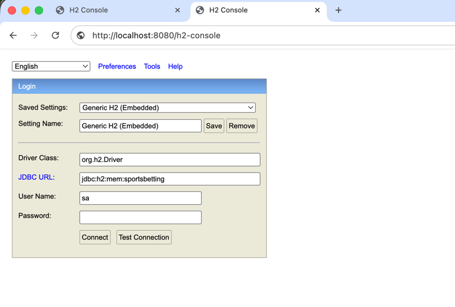
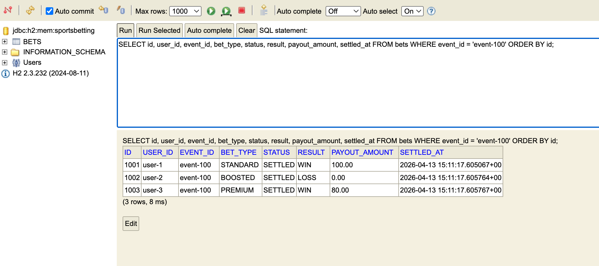

# Sports Betting Backend

Spring Boot backend that simulates sports event outcome handling with Kafka, H2, and RocketMQ. The application still runs as a single Spring Boot service, but the codebase is now split into internal Maven modules so the intake flow, core services, shared beans, and messaging adapters are separated more clearly. For this MVP bets are seeded into the in-memory H2 database at application startup so the settlement flow can be tested immediately, and additional bets can also be booked through the API.

## Prerequisites

- Java 17
- Docker Engine with Compose support
- Maven 3.9+ or the included `./mvnw`

## After checkout

From the workspace root:

```bash
git clone <repository-url>
cd SportyGroupWorkspace
```

Start the local messaging infrastructure from the workspace root. Use either `docker compose` or `docker-compose`, depending on what is available on your machine:

```bash
docker-compose up -d
```

This starts:

- ZooKeeper on `localhost:2181`
- Kafka on `localhost:9092`, with the `event-outcomes` topic created during startup
- RocketMQ NameServer on `localhost:9876`
- RocketMQ Broker on `localhost:10911`, with the `bet-settlements` topic created during startup

You can verify the containers are up with:

```bash
docker-compose ps
```

## Startup

Run the automated test suite first:

```bash
cd SportsBettingBackend
./mvnw test
```

Then start the backend service:

```bash
cd SportsBettingBackend
./mvnw -pl app -am package -DskipTests
java -jar app/target/app-0.0.1-SNAPSHOT.jar
```

The application defaults already point to the local Docker brokers:

- `KAFKA_BOOTSTRAP_SERVERS=localhost:9092`
- `ROCKETMQ_NAME_SERVER=localhost:9876`

The API will be available on `http://localhost:8080`.

When the application starts, H2 is initialized in memory and `BetDataSeeder` inserts demo open bets if the `bets` table is empty. Those seeded bets make local settlement testing immediate, and you can also create more open bets later through `POST /api/bets`.

## Module layout

The Maven reactor is split into these modules:

- `app`: runnable Spring Boot application, `application.yml`, and the end-to-end integration test
- `common-bean`: shared configuration, domain records/enums, JPA entity, repository, and data seeder
- `core-services`: business services and payout logic
- `intake-service`: REST API classes and Kafka event-outcome publisher
- `bet-settlement-service`: Kafka consumer and RocketMQ settlement publisher
- `bet-finalizer-service`: RocketMQ settlement consumer

## Optional live message monitoring

Open additional terminals before sending the API request.

Kafka monitor:

```bash
docker exec -it sporty-kafka kafka-console-consumer \
  --bootstrap-server localhost:9092 \
  --topic event-outcomes \
  --property print.key=true \
  --property key.separator=' => '
```

This keeps the consumer open and prints each published Kafka event as it arrives.

RocketMQ monitor:

```bash
while true; do
  docker exec sporty-rocketmq-broker sh -lc \
    '/home/rocketmq/rocketmq-5.3.1/bin/mqadmin consumeMessage \
      -n rocketmq-nameserver:9876 \
      -t bet-settlements \
      -c 10'
  sleep 3
done
```

The command above polls the `bet-settlements` topic repeatedly and prints the latest settlement messages.

## Proper testing

### 1. Automated tests

Run:

```bash
cd SportsBettingBackend
./mvnw test
```

Expected result:

- all tests pass
- Maven finishes with `BUILD SUCCESS`

### 2. End-to-end smoke test

With the Docker infrastructure running and the Spring Boot app started, you can first book a new bet:

```bash
curl -X POST http://localhost:8080/api/bets \
  -H 'Content-Type: application/json' \
  -d '{
    "userId": "user-9",
    "eventId": "event-300",
    "eventMarketId": "market-3",
    "eventWinnerId": "winner-9",
    "betAmount": 50.00,
    "betType": "PREMIUM"
  }'
```

Expected booking response:

```json
{
  "betId": 1005,
  "userId": "user-9",
  "eventId": "event-300",
  "eventMarketId": "market-3",
  "eventWinnerId": "winner-9",
  "betAmount": 50.00,
  "betType": "PREMIUM",
  "status": "OPEN"
}
```

Then publish an event outcome:

```bash
curl -X POST http://localhost:8080/api/event-outcomes \
  -H 'Content-Type: application/json' \
  -d '{
    "eventId": "event-100",
    "eventName": "Match Winner",
    "eventWinnerId": "winner-1"
  }'
```

Expected API response:

```json
{
  "eventId": "event-100",
  "status": "PUBLISHED",
  "topic": "event-outcomes"
}
```

### 3. Verify settlement in H2

Open the H2 console:

- `http://localhost:8080/h2-console`

Use these login settings:

- JDBC URL: `jdbc:h2:mem:sportsbetting`
- Username: `sa`
- Password: leave blank

H2 login example:



Run:

```sql
SELECT id, user_id, event_id, bet_type, status, result, payout_amount, settled_at
FROM bets
WHERE event_id = 'event-100'
ORDER BY id;
```

Expected rows:

- `1001` -> `SETTLED`, `WIN`, `100.00`
- `1002` -> `SETTLED`, `LOSS`, `0.00`
- `1003` -> `SETTLED`, `WIN`, `80.00`

Expected query output example:



## API

`POST /api/bets`

Example request:

```bash
curl -X POST http://localhost:8080/api/bets \
  -H 'Content-Type: application/json' \
  -d '{
    "userId": "user-9",
    "eventId": "event-300",
    "eventMarketId": "market-3",
    "eventWinnerId": "winner-9",
    "betAmount": 50.00,
    "betType": "PREMIUM"
  }'
```

Example response:

```json
{
  "betId": 1005,
  "userId": "user-9",
  "eventId": "event-300",
  "eventMarketId": "market-3",
  "eventWinnerId": "winner-9",
  "betAmount": 50.00,
  "betType": "PREMIUM",
  "status": "OPEN"
}
```

`POST /api/event-outcomes`

OpenAPI specification:

- `openapi.yaml`

Example request:

```bash
curl -X POST http://localhost:8080/api/event-outcomes \
  -H 'Content-Type: application/json' \
  -d '{
    "eventId": "event-100",
    "eventName": "Match Winner",
    "eventWinnerId": "winner-1"
  }'
```

Example response:

```json
{
  "eventId": "event-100",
  "status": "PUBLISHED",
  "topic": "event-outcomes"
}
```

## Seeded bets and booking

The service starts with four in-memory H2 bets:

- `event-100`: bet `1001` on `winner-1` (`STANDARD`, 100.00)
- `event-100`: bet `1002` on `winner-2` (`BOOSTED`, 75.00)
- `event-100`: bet `1003` on `winner-1` (`PREMIUM`, 40.00)
- `event-200`: bet `1004` on `winner-3` (`STANDARD`, 20.00)

If you publish outcome `event-100` with `winner-1`, the service will:

1. publish the outcome to Kafka topic `event-outcomes`
2. consume it and find matching open bets in H2
3. publish one settlement message per bet to RocketMQ topic `bet-settlements`
4. consume each settlement message and mark those bets as `SETTLED`

You can also book new open bets later with `POST /api/bets`. New IDs are allocated after the highest existing bet ID in H2.

## Configuration

Key defaults are defined in `app/src/main/resources/application.yml`:

- Kafka topic: `event-outcomes`
- RocketMQ topic: `bet-settlements`
- Payout ratios: `STANDARD=1.0`, `BOOSTED=1.5`, `PREMIUM=2.0`
- Business assumption for this MVP: `BetType` is used as a proxy for relative risk/odds.
- `STANDARD` is treated as the highest-probability, lowest-return bet type.
- `BOOSTED` is treated as a medium-probability, higher-return bet type.
- `PREMIUM` is treated as the lowest-probability, highest-return bet type.
- Payout ratios apply only when a bet result is `WIN`.
- A losing bet always settles with payout `0.00` because the full stake is treated as lost.

## Notes

- Persistence is H2 in-memory only; restarting the app resets the data.
- The H2 console is available at `http://localhost:8080/h2-console`.
- To stop the local infrastructure, run `docker-compose down` or `docker compose down` from the workspace root.
